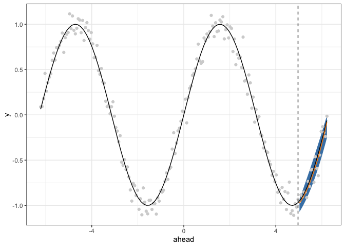

<!-- README.md is generated from README.Rmd. Please edit that file -->

# smoothqr

<!-- badges: start -->

[](https://github.com/dajmcdon/smoothqr/actions/workflows/R-CMD-check.yaml)
<!-- badges: end -->

This package estimates multi-reponse quantile regression in the context
that the resulting predictions should be “smooth”. The typical use case
would be multi-horizon time-series forecasting wherein we believe that
the responses should vary smoothly.

See the related pre-print: <https://arxiv.org/abs/2202.09723>

## Installation

You can install the development version of smoothqr from
[GitHub](https://github.com/) with:

``` r
# install.packages("remotes")
remotes::install_github("dajmcdon/smoothqr")
```

## Example

This is a basic example.

``` r
library(smoothqr)
library(ggplot2)
x <- -99:99 / 100 * 2 * pi
y <- sin(x) + rnorm(length(x), sd = .1)
XY <- lagmat(y[1:(length(y) - 20)], c(-20:20))
Y <- XY[, 1:20]
X <- XY[, 21:ncol(XY)]
tt <- smooth_qr(X, Y, c(.1, .5, .9), aheads = 20:1)

pl <- predict(tt, newdata = X[max(which(complete.cases(X))), , drop = FALSE])
pll <- dplyr::bind_rows(lapply(pl, tibble::as_tibble), .id = "ahead")
pll$ahead <- rev(x[length(y) - 19:0])
ggplot(pll) +
  geom_ribbon(
    aes(x = ahead, ymin = `tau = 0.1`, ymax = `tau = 0.9`),
    fill = "steelblue"
  ) +
  geom_point(data = data.frame(x, y), aes(x, y), color = "lightgrey") +
  geom_vline(xintercept = x[length(y) - 20], linetype = 2) +
  stat_function(fun = sin, color = "black") +
  geom_line(aes(x = ahead, y = `tau = 0.5`), color = "darkorange") +
  theme_bw()
```


