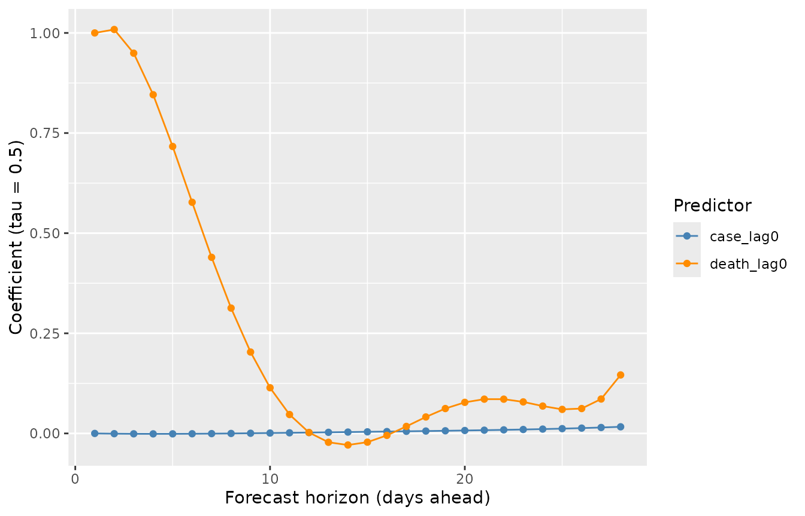
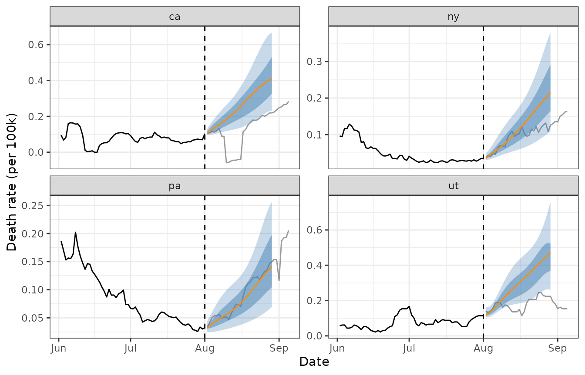

# smoothqr

``` r

library(smoothqr)
library(dplyr)
library(tidyr)
library(ggplot2)
library(lubridate)
```

## Data

This vignette demonstrates [`smooth_qr()`](reference/smooth_qr.md) on
the `covid_case_death_rates` data from the
[`epidatasets`](https://cmu-delphi.github.io/epidatasets/) package. The
data contain daily COVID-19 case and death rates (per 100,000 people)
for 56 US states/territories.

``` r

`%nin%` <- Negate(`%in%`)
covid_case_death_rates <- covid_case_death_rates |>
  filter(geo_value %nin% c("as", "gu", "mp", "vi")) |>
  select(geo_value, time_value, case_rate, death_rate)
range(covid_case_death_rates$time_value)
#> [1] "2020-12-31" "2021-12-31"
n_distinct(covid_case_death_rates$geo_value) # includes 50 states, DC, and PR
#> [1] 52
```

We’ll forecast future death rates using past case and death rates as
predictors, treating `2021-08-01` as the forecast date – the date on
which the forecaster is standing and producing predictions for future
days.

``` r

forecast_date <- ymd("2021-08-01")
```

## Building features

[`smooth_qr()`](reference/smooth_qr.md) expects a predictor matrix `x`
and a response matrix `y`, where each column of `y` corresponds to a
different forecast horizon (“ahead”). We use \[lagmat()\] to build
lagged predictors (case and death rates observed 0, 7, and 14 days
before the current time) and led responses (death rates 7, 14, 21, and
28 days ahead), separately for each location, then stack the results.

``` r

aheads <- 1:28 # days ahead to forecast death_rate
lags <- c(0, 1, 2, 7, 14) # lags (days back) used as predictors

# lagmat() must be called with the full set of shifts at once so that the
# lag and lead columns stay aligned to the same set of rows.
all_shifts <- c(-aheads, lags)
mld <- max(aheads)
mlg <- max(lags)

build_design <- function(df) {
  df <- df |> arrange(time_value)
  case_full <- lagmat(df$case_rate, all_shifts)
  death_full <- lagmat(df$death_rate, all_shifts)
  colnames(case_full) <- paste0("case_", colnames(case_full))
  colnames(death_full) <- paste0("death_", colnames(death_full))
  time_padded <- c(rep(as.Date(NA), mld), df$time_value, rep(as.Date(NA), mlg))
  bind_cols(
    time_value = time_padded,
    as_tibble(case_full),
    as_tibble(death_full)
  )
}

design <- covid_case_death_rates |>
  as_tibble() |>
  group_by(geo_value) |>
  group_modify(~ build_design(.x)) |>
  ungroup() |>
  filter(!is.na(time_value)) |>
  select(!starts_with("case_ahead"))

design
#> # A tibble: 19,032 × 40
#>    geo_value time_value case_lag0 case_lag1 case_lag2 case_lag7 case_lag14
#>    <chr>     <date>         <dbl>     <dbl>     <dbl>     <dbl>      <dbl>
#>  1 ak        2020-12-31      35.9      NA        NA        NA           NA
#>  2 ak        2021-01-01      35.9      35.9      NA        NA           NA
#>  3 ak        2021-01-02      43.0      35.9      35.9      NA           NA
#>  4 ak        2021-01-03      42.2      43.0      35.9      NA           NA
#>  5 ak        2021-01-04      44.4      42.2      43.0      NA           NA
#>  6 ak        2021-01-05      44.4      44.4      42.2      NA           NA
#>  7 ak        2021-01-06      43.7      44.4      44.4      NA           NA
#>  8 ak        2021-01-07      41.5      43.7      44.4      35.9         NA
#>  9 ak        2021-01-08      49.2      41.5      43.7      35.9         NA
#> 10 ak        2021-01-09      41.0      49.2      41.5      43.0         NA
#> # ℹ 19,022 more rows
#> # ℹ 33 more variables: death_ahead28 <dbl>, death_ahead27 <dbl>,
#> #   death_ahead26 <dbl>, death_ahead25 <dbl>, death_ahead24 <dbl>,
#> #   death_ahead23 <dbl>, death_ahead22 <dbl>, death_ahead21 <dbl>,
#> #   death_ahead20 <dbl>, death_ahead19 <dbl>, death_ahead18 <dbl>,
#> #   death_ahead17 <dbl>, death_ahead16 <dbl>, death_ahead15 <dbl>,
#> #   death_ahead14 <dbl>, death_ahead13 <dbl>, death_ahead12 <dbl>, …
```

## Fitting the model

We fit on all data up to 30 days before the forecast date, using
complete cases only ([`smooth_qr()`](reference/smooth_qr.md) drops
incomplete rows automatically).

``` r

train <- design |>
  filter(between(time_value, forecast_date - 30, forecast_date))

x_train <- train |> select(contains("lag")) |> as.matrix()
y_train <- train |> select(contains("ahead")) |> as.matrix()

fit <- smooth_qr(
  x_train,
  y_train,
  tau = c(.1, .25, .5, .75, .9),
  degree = 6L,
  aheads = aheads
)
fit
#> 
#> Call:  smooth_qr(x = x_train, y = y_train, tau = c(0.1, 0.25, 0.5, 0.75,  
#>     0.9), degree = 6L, aheads = aheads) 
#> 
#> Degree:  6 
#> tau:  0.1 0.25 0.5 0.75 0.9 
#> 
#> aheads:  1 2 3 4 5 6 7 8 9 10 11 12 13 14 15 16 17 18 19 20 21 22 23 24 25 26 
#> 27 28 
#> 
#> Coefficients:
#> # A tibble: 308 × 6
#>    response      `tau = 0.1` `tau = 0.25` `tau = 0.5` `tau = 0.75` `tau = 0.9`
#>    <chr>               <dbl>        <dbl>       <dbl>        <dbl>       <dbl>
#>  1 death_ahead28    -0.0236      -0.0215     -0.0127       0.0159      0.0228 
#>  2 death_ahead28     0.00621      0.0121      0.0165       0.0249      0.0233 
#>  3 death_ahead28     0.00328      0.00404     0.00183      0.00354     0.0115 
#>  4 death_ahead28     0.00251      0.00172     0.00599     -0.00298     0.00254
#>  5 death_ahead28    -0.00224     -0.00510    -0.00954     -0.00101    -0.0117 
#>  6 death_ahead28    -0.00255     -0.00289    -0.00461     -0.0133     -0.00779
#>  7 death_ahead28     0.148        0.126       0.146        0.0918      0.0395 
#>  8 death_ahead28    -0.0149       0.0466      0.0121       0.0223      0.0337 
#>  9 death_ahead28    -0.00630     -0.0724      0.115        0.0832      0.0458 
#> 10 death_ahead28     0.408        0.475       0.389        0.493       0.502  
#> # ℹ 298 more rows
```

### Smoothed coefficients across aheads

The central idea behind [`smooth_qr()`](reference/smooth_qr.md) is that
the predictions for neighbouring forecast horizons should vary smoothly,
rather than being estimated independently. This is controlled by
enforcing smoothness on the coefficients. We can see this by extracting
the coefficients on the response scale with
[`coef()`](https://rdrr.io/r/stats/coef.html) and examining how a single
predictor’s coefficient evolves across aheads.

``` r

cc <- coef(fit, type = "response")

coef_df <- bind_rows(
  lapply(names(cc), function(nm) {
    as_tibble(cc[[nm]], rownames = "predictor") |> mutate(response = nm)
  })
) |>
  mutate(ahead = as.numeric(gsub("death_ahead", "", response)))

coef_df |>
  filter(predictor %in% c("case_lag0", "death_lag0")) |>
  ggplot(aes(ahead, `tau = 0.5`, color = predictor)) +
  geom_line() +
  geom_point() +
  scale_colour_manual(
    values = c("case_lag0" = "steelblue", "death_lag0" = "darkorange")
  ) +
  labs(
    x = "Forecast horizon (days ahead)",
    y = "Coefficient (tau = 0.5)",
    color = "Predictor"
  )
```



## Predicting

To forecast forward from `forecast_date`, we use each location’s
predictor values observed as of that date.

``` r

newdata <- design |>
  filter(time_value == forecast_date) |>
  select(geo_value, contains("lag"))

preds <- predict(fit, newdata = newdata |> select(-geo_value))

preds_tbl <- bind_rows(
  lapply(names(preds), function(nm) {
    as_tibble(preds[[nm]]) |>
      mutate(geo_value = newdata$geo_value, response = nm)
  })
) |>
  pivot_longer(starts_with("tau"), names_to = "tau", values_to = "value") |>
  mutate(
    ahead = as.numeric(gsub("death_ahead", "", response)),
    target_date = forecast_date + ahead,
    tau = as.numeric(gsub("tau = ", "", tau))
  )

preds_tbl
#> # A tibble: 7,280 × 6
#>    geo_value response        tau value ahead target_date
#>    <chr>     <chr>         <dbl> <dbl> <dbl> <date>     
#>  1 ak        death_ahead28  0.1  0.316    28 2021-08-29 
#>  2 ak        death_ahead28  0.25 0.427    28 2021-08-29 
#>  3 ak        death_ahead28  0.5  0.526    28 2021-08-29 
#>  4 ak        death_ahead28  0.75 0.686    28 2021-08-29 
#>  5 ak        death_ahead28  0.9  0.874    28 2021-08-29 
#>  6 al        death_ahead28  0.1  0.478    28 2021-08-29 
#>  7 al        death_ahead28  0.25 0.694    28 2021-08-29 
#>  8 al        death_ahead28  0.5  0.797    28 2021-08-29 
#>  9 al        death_ahead28  0.75 1.16     28 2021-08-29 
#> 10 al        death_ahead28  0.9  1.41     28 2021-08-29 
#> # ℹ 7,270 more rows
```

## Visualizing a few locations

We compare the forecast distributions for California, New York,
Pennsylvania, and Utah against the death rates that were subsequently
observed.

``` r

geo_focus <- c("ca", "ny", "pa", "ut")

actual <- covid_case_death_rates |>
  as_tibble() |>
  filter(
    geo_value %in% geo_focus,
    time_value >= forecast_date - 60,
    time_value <= forecast_date + 35
  )

pred_wide <- preds_tbl |>
  filter(geo_value %in% geo_focus) |>
  pivot_wider(
    id_cols = c(geo_value, response, ahead, target_date),
    names_from = tau,
    values_from = value,
    names_prefix = "q"
  )

ggplot() +
  geom_line(
    data = actual |> filter(time_value <= forecast_date),
    aes(time_value, death_rate)
  ) +
  geom_line(
    data = actual |> filter(time_value > forecast_date),
    aes(time_value, death_rate),
    colour = "grey60"
  ) +
  geom_ribbon(
    data = pred_wide,
    aes(x = target_date, ymin = q0.1, ymax = q0.9),
    alpha = 0.3,
    fill = "steelblue"
  ) +
  geom_ribbon(
    data = pred_wide,
    aes(x = target_date, ymin = q0.25, ymax = q0.75),
    alpha = 0.5,
    fill = "steelblue"
  ) +
  geom_line(data = pred_wide, aes(target_date, q0.5), color = "darkorange") +
  facet_wrap(~geo_value, scales = "free_y") +
  geom_vline(xintercept = forecast_date, linetype = 2) +
  labs(
    x = "Date",
    y = "Death rate (per 100k)"
  ) +
  theme_bw()
```



Note that observed death rate in California just after the forecast date
shows a data irregularity (a brief dip below zero), which is a known
reporting artifact in this dataset rather than a reflection of real
negative deaths.
